<div align="center">

# 🔥 PyTorch Android Mobile Application


### 🚀 State-of-the-art AI Image Classification on Mobile

*Bringing the power of Deep Learning to your pocket with PyTorch Mobile*

[](https://github.com/umitkacar/Pytorch-Android-Mobile-Application/stargazers)
[](https://github.com/umitkacar/Pytorch-Android-Mobile-Application/network/members)
[](https://github.com/umitkacar/Pytorch-Android-Mobile-Application/issues)
[](LICENSE)
[](https://github.com/umitkacar/Pytorch-Android-Mobile-Application/pulls)

---

### ⭐ If you find this project useful, please give it a star! ⭐

</div>

## 📱 About The Project

A cutting-edge Android application demonstrating **real-time AI image classification** using PyTorch Mobile. This project showcases how to integrate state-of-the-art deep learning models into mobile applications for on-device inference, ensuring privacy and lightning-fast predictions without internet connectivity.

### ✨ Key Features

#### 📱 Mobile App
- 🎯 **Real-time Image Classification** - Instant predictions using ImageNet-trained models
- 🔐 **Privacy-First** - All processing happens on-device, no data leaves your phone
- ⚡ **Lightning Fast** - Optimized PyTorch Mobile inference
- 📸 **Gallery Integration** - Easy image selection from your photo library
- 🎨 **Clean Modern UI** - Intuitive and responsive user interface
- 🔋 **Battery Efficient** - Optimized for mobile performance
- 📦 **Small APK Size** - Efficient model compression
- 🌐 **Offline Capable** - Works without internet connection

#### 🐍 Python Toolkit (NEW! 2024-2025)
- 🔨 **Hatch** - Modern Python project manager
- ⚡ **Ruff** - Ultra-fast linting (replaces flake8, isort, pyupgrade)
- 🎨 **Black** - Uncompromising code formatter
- 🔍 **MyPy** - Static type checking
- 🧪 **Pytest** - Comprehensive testing with >80% coverage
- 🪝 **Pre-commit** - Automated code quality checks
- 🚀 **Model Training** - Custom model training pipeline
- 📦 **Model Export** - TorchScript & ONNX export
- 🎯 **Quantization** - Model compression for mobile

## 🎬 Demo

<div align="center">

*Coming soon: App screenshots and demo video*

</div>

## 🛠️ Tech Stack

<div align="center">

| Technology | Purpose |
|------------|---------|
|  | Deep Learning Framework |
|  | Mobile Platform |
|  | Programming Language |
|  | Image Processing |
|  | Build System |

</div>

## 🚀 Getting Started

### Prerequisites

#### For Android Development
- 📱 Android Studio Arctic Fox or newer
- ☕ JDK 11 or higher
- 🤖 Android SDK API 21+
- 🧠 Basic knowledge of Android development

#### For Python Development (Model Training)
- 🐍 Python 3.9 or higher
- 🔥 PyTorch 2.0+
- 📦 pip or uv package manager

### 📥 Quick Start - Android App

If you just want to run the Android app with a pretrained model:

1. **Clone the repository**
   ```bash
   git clone https://github.com/umitkacar/Pytorch-Android-Mobile-Application.git
   cd Pytorch-Android-Mobile-Application
   ```

2. **Quick Export Pretrained Model** 🚀 (NEW!)
   ```bash
   # Install Python dependencies
   pip install -e ".[dev]"

   # Export pretrained model and copy to Android assets
   make quick-export
   # OR manually:
   python -m pytorch_mobile.export --model mobilenet_v2 --output models/model.pt --optimize --quantize
   cp models/model.pt HelloWorldApp/app/src/main/assets/
   ```

   **Alternative:** Download pre-trained model
   - 📦 [Download model.pt from Google Drive](https://drive.google.com/file/d/1DG3dG4DKPnOQIfTE6RNqpvxp0dAD3CLQ/view?usp=sharing)
   - 📍 Place at: `HelloWorldApp/app/src/main/assets/model.pt`

3. **Open in Android Studio**
   - Open Android Studio
   - Select "Open an existing project"
   - Navigate to `HelloWorldApp` directory
   - Wait for Gradle sync to complete

4. **Build and Run**
   - Connect your Android device or start an emulator
   - Click Run ▶️ button
   - Grant storage permissions when prompted
   - Select an image and see the magic! ✨

### 🐍 Python Development Setup

For training custom models or contributing to Python code:

```bash
# Install development dependencies
pip install -e ".[dev]"

# Install pre-commit hooks
pre-commit install

# Run all checks
make dev-check

# Export a model
make quick-export

# Run tests
make test-cov
```

See [python/README.md](python/README.md) for detailed Python documentation.

## 📖 How It Works

```mermaid
graph LR
    A[📸 Select Image] --> B[🔄 Preprocess]
    B --> C[🧠 PyTorch Model]
    C --> D[🎯 Classification]
    D --> E[📊 Display Result]
```



1. **Image Selection**: User selects an image from gallery
2. **Preprocessing**: Image is resized to 320x320 and normalized
3. **Inference**: PyTorch Mobile model processes the image
4. **Classification**: Model outputs predictions across 1000 ImageNet classes
5. **Display**: Shows the top predicted class to the user

## 🌟 2024-2025 Trending AI Mobile Projects

Explore these cutting-edge repositories that are shaping the future of mobile AI:

### 🔥 PyTorch Mobile & Edge AI

1. **[PyTorch Mobile - Official](https://github.com/pytorch/pytorch)** ⭐ 80k+
   - Latest PyTorch with enhanced mobile support
   - Improved quantization and optimization tools

2. **[PyTorch Android Examples](https://github.com/pytorch/android-demo-app)** ⭐ 1.5k+
   - Official PyTorch Android demos
   - Object detection, image segmentation, NLP examples

3. **[ONNX Runtime Mobile](https://github.com/microsoft/onnxruntime)** ⭐ 13k+
   - Cross-platform ML inference
   - Supports PyTorch, TensorFlow, and more

### 🤖 Generative AI on Mobile

4. **[MediaPipe](https://github.com/google/mediapipe)** ⭐ 26k+
   - Google's cross-platform ML solutions
   - Face detection, pose estimation, object tracking

5. **[MLC LLM](https://github.com/mlc-ai/mlc-llm)** ⭐ 18k+
   - Run Large Language Models on mobile devices
   - Llama, Mistral, Phi support

6. **[Stable Diffusion Mobile](https://github.com/huggingface/swift-coreml-diffusers)** ⭐ 2.5k+
   - Text-to-image generation on mobile
   - Optimized for iOS and Android

### 🎨 Computer Vision Mobile Apps

7. **[YOLOv8 Mobile](https://github.com/ultralytics/ultralytics)** ⭐ 25k+
   - Latest YOLO for real-time object detection
   - Mobile-optimized versions

8. **[Segment Anything Mobile (SAM)](https://github.com/facebookresearch/segment-anything)** ⭐ 45k+
   - Meta's cutting-edge segmentation model
   - Mobile deployment examples

9. **[MobileViT](https://github.com/apple/ml-cvnets)** ⭐ 6k+
   - Apple's mobile vision transformers
   - State-of-the-art mobile efficiency

### 🗣️ Speech & NLP on Mobile

10. **[Whisper Mobile](https://github.com/openai/whisper)** ⭐ 65k+
    - OpenAI's speech recognition
    - Mobile-optimized versions available

11. **[FastChat Mobile](https://github.com/lm-sys/FastChat)** ⭐ 35k+
    - Train and deploy chatbots on mobile
    - Vicuna, Alpaca model support

### 🔧 Optimization & Deployment Tools

12. **[ExecuTorch](https://github.com/pytorch/executorch)** ⭐ 1.5k+ 🆕
    - PyTorch's new edge runtime (2024)
    - Ultra-lightweight mobile inference

13. **[TensorFlow Lite](https://github.com/tensorflow/tensorflow)** ⭐ 184k+
    - Mobile & edge ML framework
    - Wide hardware support

14. **[Neural Magic](https://github.com/neuralmagic/sparseml)** ⭐ 2k+
    - Model optimization and sparsification
    - 2-10x speedup on mobile devices

### 🌐 Cross-Platform Solutions

15. **[React Native PyTorch](https://github.com/react-native-pytorch/react-native-pytorch-core)** ⭐ 250+
    - PyTorch for React Native
    - Cross-platform AI apps

16. **[Flutter TFLite](https://github.com/tensorflow/flutter-tflite)** ⭐ 400+
    - TensorFlow Lite for Flutter
    - Beautiful cross-platform AI apps

## 📊 Model Information

- **Architecture**: MobileNetV2 / ResNet
- **Dataset**: ImageNet (1000 classes)
- **Input Size**: 320x320 pixels
- **Format**: TorchScript (.pt)
- **Inference Time**: ~50-100ms on modern devices

## 🎓 Educational Resources

### Learn PyTorch Mobile (2024-2025)

- 📺 [PyTorch Mobile Tutorial Series](https://pytorch.org/mobile/home/)
- 📚 [Deep Learning for Mobile - Course](https://www.coursera.org/learn/deep-learning)
- 🎥 [Building AI Apps on Android](https://www.youtube.com/c/PyTorch)
- 📖 [On-Device ML Best Practices](https://developers.google.com/machine-learning)

### Trending Topics

- 🔥 **Edge AI**: Running LLMs on mobile devices
- 🎨 **Generative AI**: Stable Diffusion, Midjourney on mobile
- 🗣️ **Multimodal Models**: Vision + Language models
- ⚡ **Quantization**: INT8, FP16 optimization
- 🔐 **Privacy-Preserving ML**: Federated Learning on mobile

## 🤝 Contributing

Contributions are what make the open-source community an amazing place to learn, inspire, and create!

**Any contributions you make are greatly appreciated!** ⭐

1. Fork the Project
2. Create your Feature Branch (`git checkout -b feature/AmazingFeature`)
3. Commit your Changes (`git commit -m 'Add some AmazingFeature'`)
4. Push to the Branch (`git push origin feature/AmazingFeature`)
5. Open a Pull Request

### 💡 Ideas for Contribution

- 🎨 Improve UI/UX design
- 🚀 Add new model architectures (YOLO, SAM, etc.)
- 📱 Add camera capture functionality
- 🎬 Implement video processing
- 🌐 Multi-language support
- 📊 Add confidence scores visualization
- 🔧 Performance optimizations
- 📝 Documentation improvements

## 🐛 Known Issues & Roadmap

- [ ] Add real-time camera inference
- [ ] Implement model switching (YOLOv8, SAM)
- [ ] Add batch image processing
- [ ] Create iOS version
- [ ] Add Jetpack Compose UI
- [ ] Implement model quantization
- [ ] Add performance metrics display
- [ ] Create comprehensive test suite

## 📄 License

Distributed under the MIT License. See `LICENSE` for more information.

## 👨‍💻 Author

**Ümit Kacar**

- GitHub: [@umitkacar](https://github.com/umitkacar)

## 🙏 Acknowledgments

- [PyTorch Team](https://pytorch.org/) for the amazing framework
- [ImageNet](https://www.image-net.org/) for the dataset
- [Android Developers](https://developer.android.com/) for documentation
- All contributors who help improve this project

## 📈 Project Stats

<div align="center">


</div>

## 🌐 Connect & Learn More

<div align="center">

[](https://pytorch.org/mobile/)
[](https://developer.android.com/ml)
[](https://towardsdatascience.com/object-detector-android-app-using-pytorch-mobile-neural-network-407c419b56cd)

</div>

---

<div align="center">

### ⭐ Don't forget to star this repo if you find it useful! ⭐

**Made with ❤️ and PyTorch 🔥**

</div>
