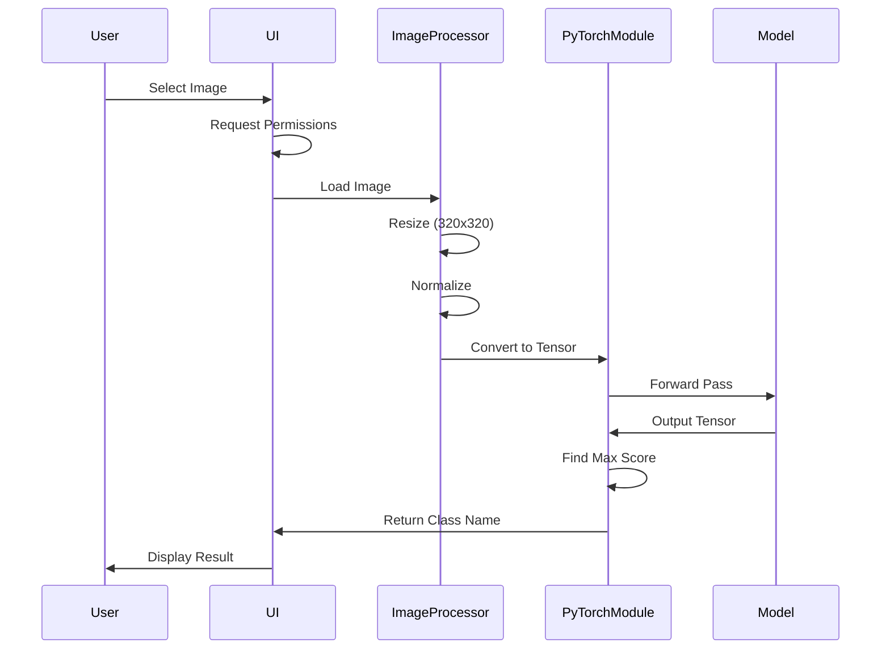

# 🏗️ Architecture Documentation

## Overview

This document provides a comprehensive overview of the PyTorch Android Mobile Application architecture.

## 📊 Architecture Diagram

```
┌─────────────────────────────────────────────────────────────┐
│                     Android Application                      │
├─────────────────────────────────────────────────────────────┤
│                                                               │
│  ┌──────────────┐      ┌──────────────┐      ┌───────────┐ │
│  │     UI       │      │   Business   │      │   Data    │ │
│  │    Layer     │─────▶│    Logic     │─────▶│   Layer   │ │
│  └──────────────┘      └──────────────┘      └───────────┘ │
│        │                      │                      │       │
│        │                      │                      │       │
│        ▼                      ▼                      ▼       │
│  ┌──────────────┐      ┌──────────────┐      ┌───────────┐ │
│  │  MainActivity│      │  Image       │      │  Model    │ │
│  │              │      │  Processor   │      │  Manager  │ │
│  └──────────────┘      └──────────────┘      └───────────┘ │
│                                                               │
├─────────────────────────────────────────────────────────────┤
│                    PyTorch Mobile Layer                      │
├─────────────────────────────────────────────────────────────┤
│  ┌────────────────────────────────────────────────────────┐ │
│  │                  PyTorch Runtime                        │ │
│  │                                                          │ │
│  │  • Module Loading    • Tensor Operations                │ │
│  │  • Inference Engine  • Memory Management                │ │
│  └────────────────────────────────────────────────────────┘ │
└─────────────────────────────────────────────────────────────┘
                              │
                              ▼
                    ┌──────────────────┐
                    │   ML Model       │
                    │   (model.pt)     │
                    └──────────────────┘
```

## 🧩 Components

### 1. UI Layer

**MainActivity.java**
- Main entry point of the application
- Handles user interactions
- Manages image selection flow
- Displays classification results

**Responsibilities:**
- Image selection via gallery picker
- Permission handling
- Result visualization
- User feedback

### 2. Business Logic Layer

**Image Processing**
- Bitmap loading and manipulation
- Image resizing (320x320)
- Normalization using ImageNet statistics
- Tensor conversion

**Model Management**
- Model loading from assets
- Model initialization
- Inference execution
- Result post-processing

### 3. Data Layer

**Assets**
- `model.pt` - Pre-trained PyTorch model
- ImageNet class labels (1000 classes)

**External Storage**
- Gallery images (read-only access)

## 🔄 Data Flow

### Image Classification Flow



### Detailed Steps

1. **Image Selection**
   ```java
   Intent intent = new Intent(Intent.ACTION_PICK);
   intent.setType("image/*");
   startActivityForResult(intent, PICK_IMAGE);
   ```

2. **Image Preprocessing**
   ```java
   Bitmap resized = Bitmap.createScaledBitmap(bitmap, 320, 320, false);
   Tensor inputTensor = TensorImageUtils.bitmapToFloat32Tensor(
       resized,
       TensorImageUtils.TORCHVISION_NORM_MEAN_RGB,
       TensorImageUtils.TORCHVISION_NORM_STD_RGB
   );
   ```

3. **Model Inference**
   ```java
   Module module = Module.load(assetFilePath(context, "model.pt"));
   Tensor outputTensor = module.forward(IValue.from(inputTensor)).toTensor();
   ```

4. **Result Processing**
   ```java
   float[] scores = outputTensor.getDataAsFloatArray();
   int maxScoreIdx = findMaxScoreIndex(scores);
   String className = ImageNetClasses.IMAGENET_CLASSES[maxScoreIdx];
   ```

## 🧠 Model Architecture

### Input Specifications

- **Format**: RGB Image
- **Size**: 320 × 320 pixels
- **Type**: Float32 Tensor
- **Normalization**:
  - Mean: [0.485, 0.456, 0.406]
  - Std: [0.229, 0.224, 0.225]

### Output Specifications

- **Format**: Float32 Array
- **Size**: 1000 (ImageNet classes)
- **Type**: Logits (pre-softmax scores)

### Model Information

- **Framework**: PyTorch
- **Format**: TorchScript (.pt)
- **Possible Architectures**:
  - MobileNetV2 (lightweight, fast)
  - ResNet18/34 (accuracy-optimized)
  - EfficientNet (balanced)

## 📦 Dependencies

### Core Dependencies

```gradle
dependencies {
    // PyTorch Android
    implementation 'org.pytorch:pytorch_android:1.10.0'
    implementation 'org.pytorch:pytorch_android_torchvision:1.10.0'

    // AndroidX
    implementation 'androidx.appcompat:appcompat:1.6.1'
    implementation 'androidx.core:core-ktx:1.12.0'

    // UI Components
    implementation 'com.google.android.material:material:1.11.0'
}
```

## 🔐 Security Considerations

### Data Privacy
- ✅ All processing happens on-device
- ✅ No network communication
- ✅ No data logging or storage
- ✅ Images processed in memory only

### Permissions
- `READ_EXTERNAL_STORAGE` - Required for gallery access
- No internet permissions needed

## ⚡ Performance Considerations

### Optimization Strategies

1. **Model Optimization**
   - Use quantized models (INT8) for faster inference
   - Model pruning to reduce size
   - TorchScript optimization

2. **Memory Management**
   - Image caching strategies
   - Proper bitmap recycling
   - Tensor memory cleanup

3. **Threading**
   - UI thread for user interactions
   - Background thread for model inference
   - AsyncTask or Coroutines for async operations

### Performance Metrics

- **Inference Time**: 50-100ms (device dependent)
- **Model Size**: ~15-50MB (architecture dependent)
- **Memory Usage**: ~100-200MB peak
- **Battery Impact**: Minimal (on-device processing)

## 🚀 Scalability

### Future Enhancements

1. **Multi-Model Support**
   - Model switching
   - Multiple simultaneous models
   - Model download manager

2. **Advanced Features**
   - Real-time camera inference
   - Video processing
   - Batch processing

3. **Architecture Improvements**
   - MVVM pattern
   - Repository pattern
   - Dependency injection

## 📚 References

- [PyTorch Mobile Documentation](https://pytorch.org/mobile/home/)
- [Android ML Best Practices](https://developer.android.com/ml)
- [TorchScript Guide](https://pytorch.org/docs/stable/jit.html)

## 🤝 Contributing

See [CONTRIBUTING.md](../CONTRIBUTING.md) for architecture contribution guidelines.

---

**Last Updated**: 2024-2025

**Maintained by**: [@umitkacar](https://github.com/umitkacar)
